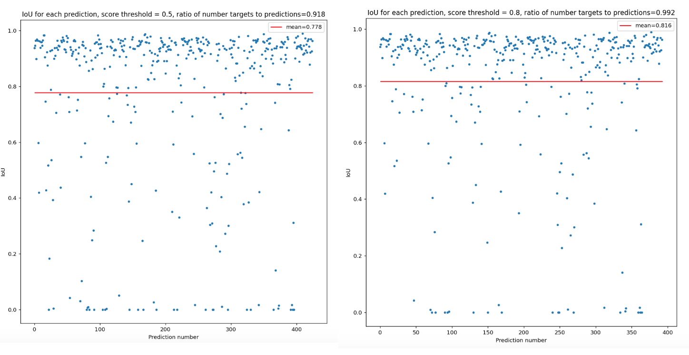

--------------------------------------------------------------------------------
# Introduction
For my capstone project at General Assembly I chose to build off of the existing work by my former colleague, Drew Byron, to test the feasibility of using object detection CNN's for event reconstruction in the He6-CRES experiment. I forked his `he6_cres_deep_learning` repo which has the simulation software necessary for generating the kind of spectrogram images seen in the experiment at the University of Washington, edited it to include boundary box ground-truth outputs, and building off examples in PyTorch in his tutorial series at https://github.com/drewbyron/pytorch-tutorials I built the framework necessary for training a Faster R-CNN object detection model on the simulated data. In order to accelerate the work, a GPU instance was used on Amazon's AWS for the training of the model. This repo details what was done in order to get the simulation and modeling pipeline to a functional state, and this README serves as the instruction manual for how to generate your own spec files to train a Faster R-CNN model for event reconstruction in CRES events, as well as how to run it on an AWS instance if you so choose.

### he6_cres_deep_learning

This folder contains modules and scripts for transforming track information data into simulated spectrogram images as seen by the He6-CRES experiment. All done by Drew Byron in his original repo.

### fasterRCNN

This folder contains the work for this project. Three notebooks are present, the two `towards_faster_rcnn` and `towards_modeling` are where the spec simulation and modeling pipelines were figured out, respectively. `modeling_interpretation` is where the first Faster R-CNN model trained on CRES data is evaluated. The script `fasterRCNN_ds.py` is what allows one to generate spectrogram images with ground-truth boundary boxes for use in training a Faster R-CNN model. `modeling.py` is the script that will allow for the training of the model of choice. 

--------------------------------------------------------------------------------
# Background

The [He6-CRES](http://faculty.washington.edu/agarcia3/Chirality-flipping/He6-CRES/) experiment at UW is the second experiment ever to look at beta decay (proton/neutron spits out electron/positron and a neutrino and becomes neutron/proton) with the Cyclotron Radiation Emission Spectroscopy technique. The goal is to measure the shape of the beta spectrum (probability distribution for the energy of the electron/positron) to high enough precision to put new limits on the existence of physics not predicted by the Standard Model. The data is comprised of many spectrogram images which are (hopefully) full of events that look like this:

Taken from Heather Harrington's General Exam

What is being shown is the power captured by radiation emitted by an electron that is trapped inside of a superconducting magnet. The energy of the electron is inversely proportional to the frequency at which this radiation is emitted. Thus, by determining the start frequency of the event we can determine the energy of the electron *at the moment it was created*. This will allow for unprecedented accuracy in determining the energy at which the electron was created.
  
The goal of this project is to see if an object detection model like Faster R-CNN is capable of identifying events of this type - broken track segments and all - and is worth pursuing to use in the analysis of CRES events. It will also lay the groundwork for applying more advanced instance segmentation models such as Mask R-CNN.

--------------------------------------------------------------------------------

# Methodology

I began by writing a script to generate track-level information of events. This is not a physical simulation, but the produced tracks replicate the look of real events well enough for the purpose of this project. The output also needed to include boundary boxes that will act as the ground-truth targets for training the model. 

Tracks with boundary boxes overlaid

Then the track DataFrame was passed to Drew's simulation to be transformed into spectrogram files. In short this simulation transforms the tracks into images where the pixel width is a time-slice (5126 slices for the .035s long files used in this project), pixel height is a frequency bin (4096 frequency bins), and color is the power present in that pixel represented as an 8 bit number. 

Example of simulated spectrogram, max-pool factor of 8 applied for visibility

These spectrograms can be simulated in large number with the `fasterRCNN_ds.py` script, along with a 'labels' file with the ground-truth boundary boxes. Instructions for how to do this will be included later. These will be the input to the `modeling.py` script which houses the PyTorch-Lightning pipeline to train a Faster R-CNN model. For this work I used the built-in [ResNet50-FPN](https://pytorch.org/vision/main/models/generated/torchvision.models.detection.fasterrcnn_resnet50_fpn.html#torchvision.models.detection.fasterrcnn_resnet50_fpn) backbone model with pre-trained weights from the [COCO](https://cocodataset.org/#home) challenge for fine-tuning and faster convergence. The workflow of this process looks like this:
* Dataset class loads the data and transforms it to form expected by the built-in Faster R-CNN model
* LightningDataModule class calls the Dataset and handles the train/val/test splits, batch collation, and shuffling of data
* LightningModule class configures the model and handles the forward/training/validation steps
* Training object takes in the latter two for training of the model and logging of parameters of choice as it goes
Once this pipeline was confirmed to be working the model was trained on an AWS GPU instance. The Adam optimizer was used with a learning rate of $10^{-4}$, 100 epochs to train. 1000 total images were used, 60% for training, 30% for validation, 10% for testing. A max-pool factor of 16 was applied before training.

--------------------------------------------------------------------------------

# Results

The model converged and produced some very successful results:

(Left) Spectrogram from the testing set. (Right) Spectrogram with target (red) and prediction (green) boundary boxes overlaid.

It is clear that for distinct events the model is capable of performing very well, though this is not the case when events are close in frequency:

However, even if this is an inescapable feature of these kinds of models on this data, this type of overlap can be avoided because **event rate is a tunable parameter in the experiment**. So, at a glance the model performing quite well. In order to quantify this I attempted to measure the Mean Average Precision (mAP) of the predictions on the test set, as all of the literature on object detection models agree that this is best metric for evaluating performance. Unfortuantely, I could not get the full range of the precision vs. recall curve necessary to make this calculation. Instead I looked at the Intersection Over Union metric (IoU). This measures the ratio of the area of the intersection predicted and target boxes to the total area comprised by the boxes. I also measured the number of total predictions to the number of targets to get an idea (but not an exact measure) of the accuracy of the model.

Overall the results are very promising. Increasing the score cut on the output boundary boxes led to better average IoU and closer number of predictions to targets.

--------------------------------------------------------------------------------

# Conclusion

This project was the first example of applying an object detection deep learning model to (simulated) CRES data. With no hyperparameter tuning and a limited size dataset the model converged and provided some very good results. A mean IoU of ~.8 was achieved, with well over 90% of targets being matched to a prediction. This work demonstrates that these types of deep learning frameworks are at the very least worth pursuing for reconstructing events in CRES data. Further, with few changes to the labels output in the simulation script and the PyTorch classes, a Mask R-CNN pipeline could be created and tested for possible further model improvement. 

--------------------------------------------------------------------------------

## Instructions for building a training dataset and training a model: 

I will briefly go over the process of generating your own spectrogram files and training a model. The latter will also include instructions on how to set up an AWS instance for training, as well as running jupyter lab from the instance if you wish to use the notebooks in the GPU environment. I will assume that all command line inputs are done from inside of the folder `fasterRCNN`. The two scripts have default values for each argument that I will show below, so in theory you could simply run `python3 <enter script name>.py` and get some results. I show all of the available arguments for completeness, and describe each in turn. 

--------------------------------------------------------------------------------

### `fasterRCNN_ds.py`

#### Syntax

`python3 fasterRCNN_ds.py -d "fasterRCNN" -c "config/base_daq_config.yaml" -gn "gain_noise/base_gain_noise.csv" -n_files 1000 -n_events 3 -len .035 -seed 24436 -slope_mean 2e8 -slope_std 1e7`

#### Arguments

`-d`: name of directory you wish to store results of simulation in (doesn't need to be created beforehand)
`-c`: configuration file to for spectrogram simulation  
`-gn`: gain_noise file for spectrogram simulation  
`-n_files`: number of files to simulate  
`-n_events`: mean number of events per file (poisson distribution used for this work)  
`-len`: length in seconds of spectrogram  
`-seed`: random seed to use  
`-slope_mean`: mean value of track slope distribution (normal distribution used for this work)  
`slope_std`: standard deviation of slope distribution  

--------------------------------------------------------------------------------

### `modeling.py`

#### **If you wish to use a GPU for training then first follow below instructions on starting AWS instance (or use whichever GPU service you prefer).**

#### Syntax

`python3 modeling.py  -rd "config/fasterRCNN" -fb 4096 -mp 16 -f 1000 -t None -ts (0.6,0.3,0.1) -bs 1 -sd True -s 42 -nw 4 -cm {0: {"name": "background","target_color": (255, 255, 255),},1: {"name": "event","target_color": (255, 0, 0)}} -nc 2 -lr .0001 -p True -e 100`

#### Arguments

`-rd`: Directory that has the label file directory and spec file directory
`-fb`:  number of frequency bins in spec file  
`-mp`: max-pooling factor to use  
`-f`: number of files to use for training  
`-t`: transformation to apply to images during training  
`-ts`: fractions used for train/val/test split  
`-bs`: batch size  
`-sd`: whether or not to shuffle train/val sets prior to training  
`-seed`: random seed  
`-nw`: number of cpu cores for loading data  
`-cm`: class map for faster R-CNN model  
`-nc`: number of classes in model  
`-lr`: learning rate for Adam algorithm  
`-p`: whether to use pretrained weights or not  
`-e`: number of epochs to use in training

--------------------------------------------------------------------------------

## Operating from AWS GPU instance

I assume some prior knowledge of AWS EC2 services. If you have none here are the docs: https://docs.aws.amazon.com/ec2/index.html

### Starting GPU instance
* Go to EC2 Dashboard
* Click *Launch Instance*
    * Give descriptive name
* Under AMI search 'deep learning'
    * The specific AMI used in this work was Deep Learning AMI GPU PyTorch 1.12.1 (Ubuntu 20.04) 20221114
ami-08870b6ab8c849412 (64-bit (x86))
* Under instance type choose one that has at least one GPU available
    * Instance used in this case is g4dn.xlarge
    * If you have just created an account then you will need to request a limit increase. My first one was rejected, but with more detail given to the project and also having run the simulation on a t2.large instance I was approved for the increase. 
* Choose your pem key
    * pem key instructions: https://docs.aws.amazon.com/AWSEC2/latest/UserGuide/create-key-pairs.html
* Configure storage and launch instance
* Run `ssh -i <your_pem_file> ubuntu@<instance_public_DNS_address>` from your terminal to SSH into instance
* Clone this repository
* Run `source activate pytorch`
* Follow the above instructions to train the model!

### JupyterLab from AWS

After having launched your instance if you wish to run JupyterLab from the instance follow these steps:

* SSH into the instance
* Run `source active pytorch`
* Run `jupyter lab --no-browser --port=8888`
* Open a new terminal window
* SSH with these modifications: `ssh -i <your_pem_file> -L 5511:127.0.0.1:8888 ubuntu@<instance_public_DNS_address>`
* Open your internet browser of choice
* Enter URL: `http://127.0.0.1:5511/lab/`
You are now running JupyterLab through the AWS instance!